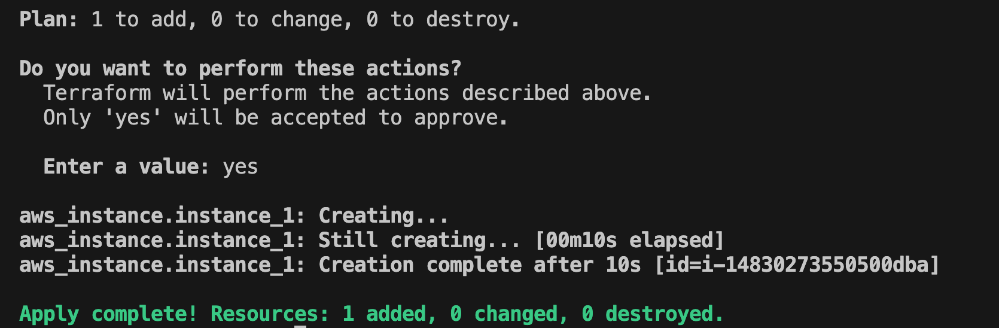

# Terraform practice


## Setup (on Mac)
### Install terraform
- Follow [Link](https://developer.hashicorp.com/terraform/tutorials/aws-get-started/install-cli)
```zsh
# install
brew tap hashicorp/tap
brew install hashicorp/tap/terraform

#verify
terraform -version
terraform -help
terraform plan -help

# enable tab completion - not work for me
terraform -install-autocomplete
```


### install localstack & aws cli
- Requirements: 
  - docker
  - python3
```sh
brew install localstack/tap/localstack-cli
localstack start -d
localstack status services

brew install awscli
echo "endpoint_url = http://localhost:4566" >> ~/.aws/config
kinesis list-streams
```

- Follow [Link](https://docs.localstack.cloud/aws/integrations/aws-native-tools/aws-cli/#localstack-aws-cli-awslocal)


## Write tf code
- Check [main.tf](main.tf)

## Run 
```sh
terraform init
terraform plan
terraform apply
aws ec2 describe-instances
```



- New file: [terraform.tfstate](./terraform.tfstate)

## Other commands
```sh
# to save plan
terraform plan -out plan.out
terraform show -json plan.out > plan.json


# to apply saved plan
terraform apply "plan.out"

# to destroy
terraform destroy
```