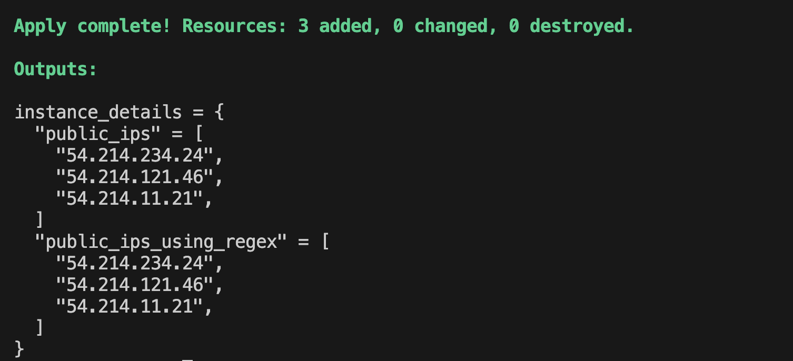

# For
- Syntax:
```
for <value> in <list>: <return value>
```
- Example
```hcl
# 1
[for s in var.words: upper(s)]

# 2
{for k,v in var.words: k => upper(s)}
```

- Use for to summarize all public ip

```
output "ec2" {
  value = {
    public_ip = [ for v in aws_instance.instances_6 : v.public_ip ]
  }
}
```


## run terraform
```
terraform init
terraform plan
terraform apply -auto-approve
```
