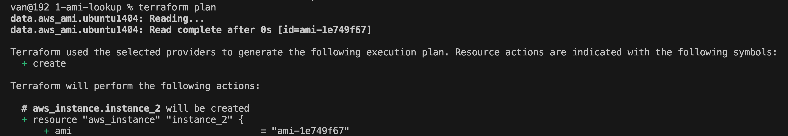
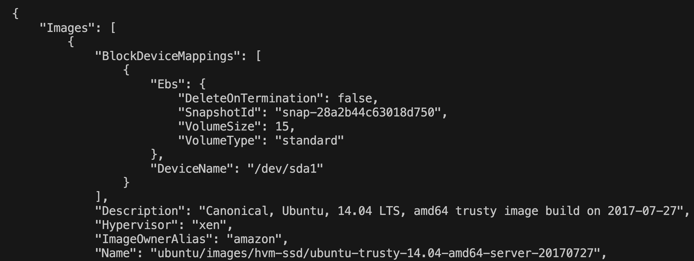

# Data lookup
- use data block to call API to AWS to get AMI info
```
data "aws_ami" "ubuntu1404" {
    most_recent = true
    owners      = ["099720109477"] # Canonical
    # name_regex  = "ubuntu/images/hvm-ssd/ubuntu-trusty-14.04-amd64-server-*"
    filter {
        name   = "name"
        values = ["ubuntu/images/hvm-ssd/ubuntu-trusty-14.04-amd64-server-*"]
    }
}
```
- usage: data.aws_ami.ubuntu1404.id

- run plan


- check ami ami-1e749f67
```sh
aws ec2 describe-images --image-ids ami-1e749f67
```

