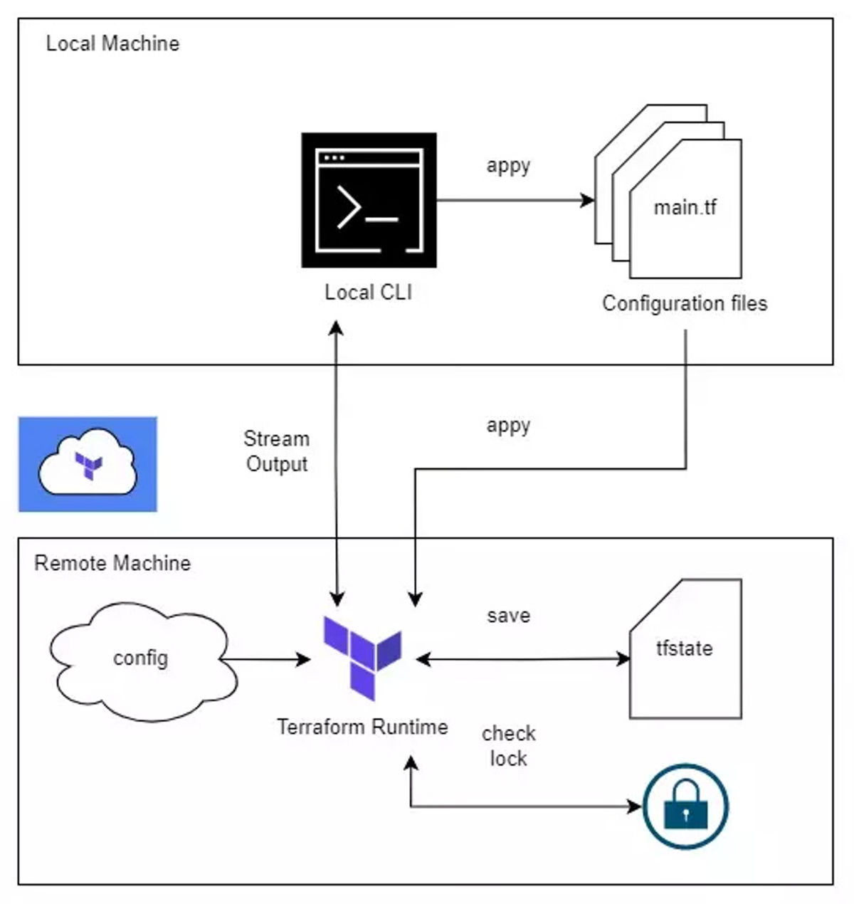
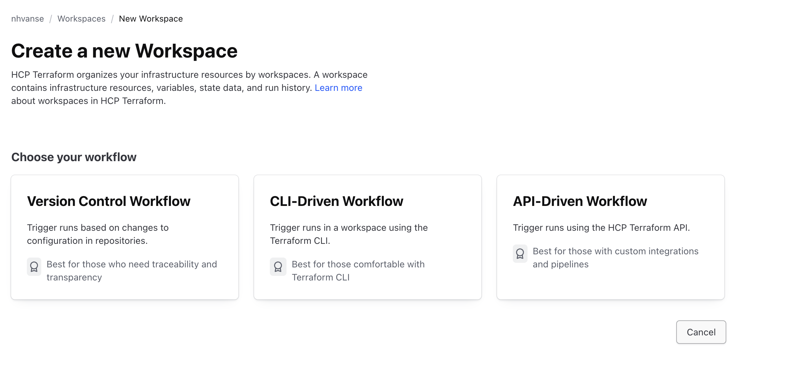
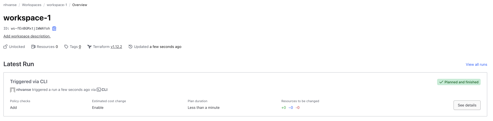
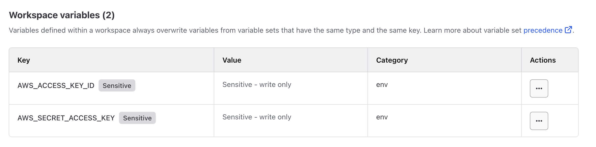
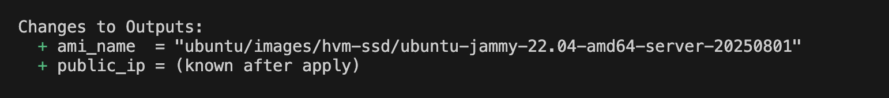

# Terraform cloud

- a service from Hashicorp, helps us manage resources easily and securely
- it also helps us CI/CD for infrastructure

## 3 approaches of usage
- Version control workflow
- CLI-driven workflow
- API-drivern workflow


## Start
- Go [app.terraform.io](https://app.terraform.io/)
- Register
- Create organization. E.g. nhvanse
- Create a workflow, Choose CLI-driven workflow, enter workspace name, e.g. workspace-1


- Run `terraform login` and copy token from browser and paste to cli input


## Usage
```hcl
terraform {
  cloud {
    organization = "nhvanse"
    workspaces {
      name = "workspace-1"
    }
  }
}
```

- Run
```sh
terraform init
terraform apply
```

- Output in browser



## Add main.tf
- add resource aws instance
- Run
```
terraform plan
```
- We will have this error:
```text
│ Error: No valid credential sources found
│ 
│   with provider["registry.terraform.io/hashicorp/aws"],
│   on main.tf line 1, in provider "aws":
│    1: provider "aws" {
│ 
│ Please see https://registry.terraform.io/providers/hashicorp/aws
│ for more information about providing credentials.
│ 
│ Error: failed to refresh cached credentials, no EC2 IMDS role found,
│ operation error ec2imds: GetMetadata, request canceled, context deadline
│ exceeded
│ 
╵
Operation failed: failed running terraform plan (exit 1)
```


## Setup credentials
- We need to add aws credentials to Remote Backend (more secure than saving credentials in local)
  - Copy access key from AWS console:
    - Go [AWS console security credentials](https://us-east-1.console.aws.amazon.com/iam/home?region=us-east-1#/security_credentials)
    - Create access key
    - Then copy Access key as `AWS_ACCESS_KEY_ID` and Secret access key as `AWS_SECRET_ACCESS_KEY`
  - On browser - Terraform page:
    - Enter your workspace. e.g workspace-1
    - Click variables in the left menu
    - Click Add variable
        - Choose Environment variable
        - Key = AWS_ACCESS_KEY_ID
        - Value = <Access key from aws console>
    - Click Add variable
        - Choose Environment variable
        - Key = AWS_SECRET_ACCESS_KEY
        - Value = <Access key from aws console>
        - Click sensitive
    

## Run terraform
- This command run successfully
```
terraform plan
```



- **NOTE**: Please note that AWS will charge you if you run terraform apply to add resources in AWS
    

