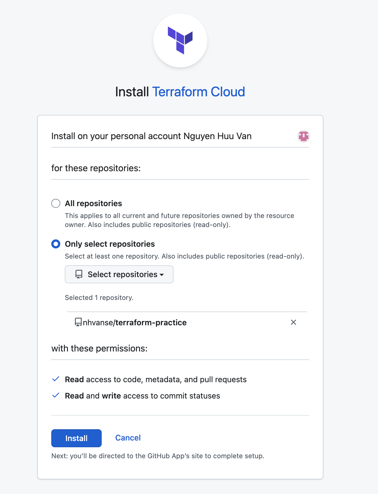

# CI CD terraform cloud zero downtime
- Using Version Control Workflow


## Setup
- On Terraform page
  - Create a new workspace.
  - Choose Version Control Workflow
  - Connect to VCS: Github (please allow pop-up in browser)
  - 
  - Choose a repository. e.g terraform-practice
  - Setup working directory: Go Settings -> General -> Terraform Working Directory -> Enter `11-CI-CD-terraform-zero-downtime`
  - Setup AWS credentials: Generate access key and secret key on AWS console and Go Variables -> Add variable `AWS_ACCESS_KEY_ID` and `AWS_SECRET_ACCESS_KEY`. For more details, check [10-terraform-cloud/README.md](../10-terraform-cloud/README.md)


## Write code
```hcl
data "aws_ami" "ami" {
    most_recent = true
    owners      = ["099720109477"] # Canonical
    filter {
        name   = "name"
        values = ["ubuntu/images/hvm-ssd/ubuntu-*"]
    }
}

resource "aws_instance" "instance_11" {
    ami           = data.aws_ami.ami.id
    instance_type = "t2.micro"
    tags = {
        Name        = "instance_11"
    }
}
```

```
git add main.tf
git commit -m "add example ec2 instance_11"
git push
```

- Check `Runs` on Terraform page


- We can choose Confirm & Apply or Discard Run

## Zero downtime deployment with `create_before_destroy`
- Can apply to EC2 instances
- Can not apply to S3 bucket

- Example: 
    - If you already apply and instance_11 is there in aws
    - You want to change ami, it is a `force-new attributes` so terraform will terminate the current instance and create a new one.
    - To have zero downtime, add `create_before_destroy`
    ```
        resource "aws_instance" "instance_11" {
            ami           = data.aws_ami.ami.id
            instance_type = "t2.micro"
            tags = {
                Name        = "instance_11"
            }


            lifecycle {
                create_before_destroy = true
            }
        }
    ```


