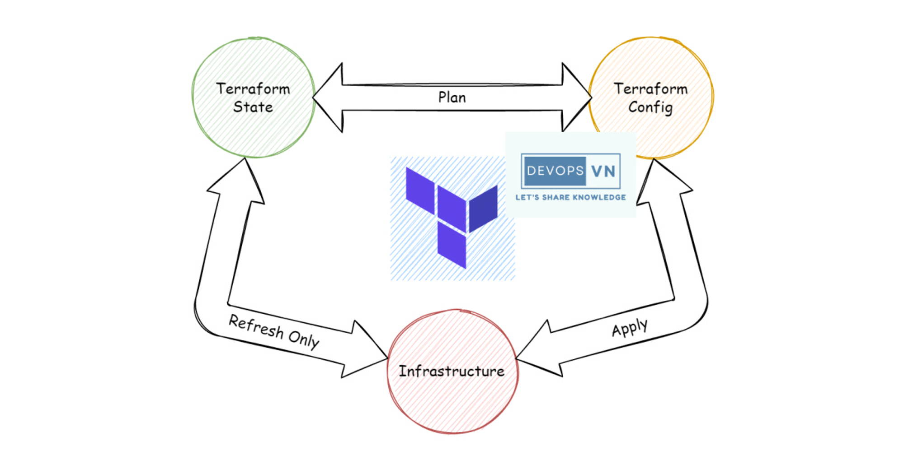
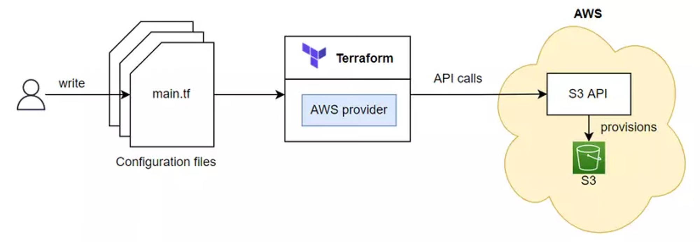
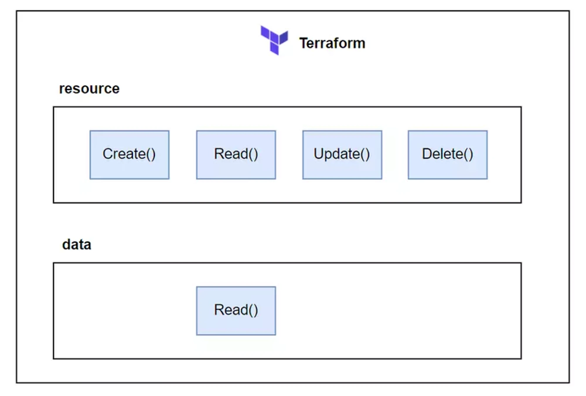
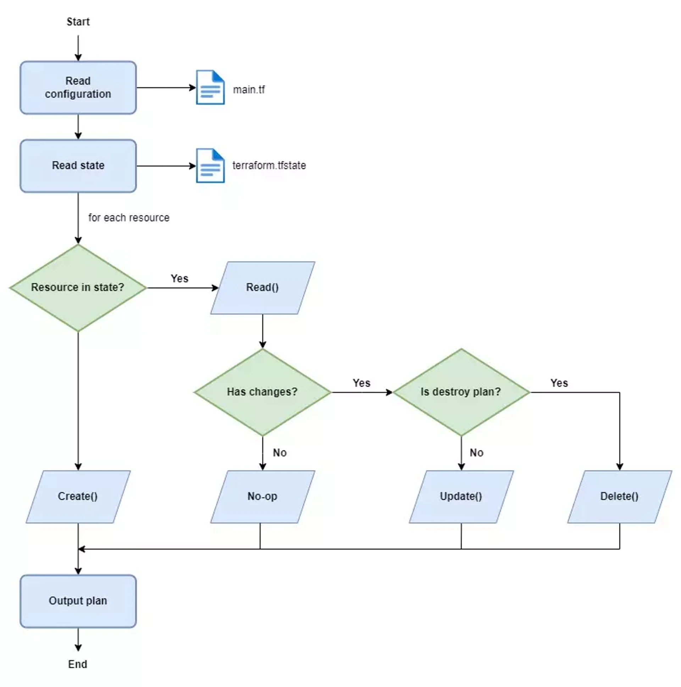
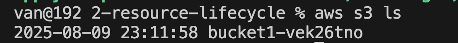
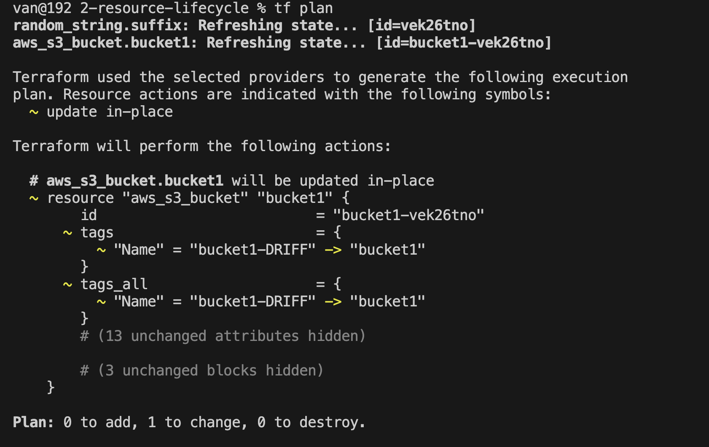

# resource lyfecycle






## methods



## test s3
- Check [s3.tf](./s3.tf)
- using resource random_string, the random string result will be saved in terraform.tfstate
- Must set `s3_use_path_style` as `true` because we are using LocalStack

## Run plan




## Run apply
```
terraform apply -auto-approve
```
- call create method


## Result



## Resource Drift
- when actual state is not the same as saved state (the resource was changed outside of terraform)
- Check current tag:
```
aws s3api get-bucket-tagging --bucket bucket1-vek26tno
{
    "TagSet": [
        {
            "Key": "Name",
            "Value": "bucket1"
        }
    ]
}
```
- change tag outside of terraform
```
aws s3api put-bucket-tagging --bucket bucket1-vek26tno --tagging 'TagSet=[{Key=Name,Value=bucket1-DRIFF}]'

aws s3api get-bucket-tagging --bucket bucket1-vek26tno
{
    "TagSet": [
        {
            "Key": "Name",
            "Value": "bucket1-DRIFF"
        }
    ]
}
```

- run tf plan


- run tf apply
```
terraform apply -auto-approve
aws s3api get-bucket-tagging --bucket bucket1-vek26tno
{
    "TagSet": [
        {
            "Key": "Name",
            "Value": "bucket1"
        }
    ]
}
```

