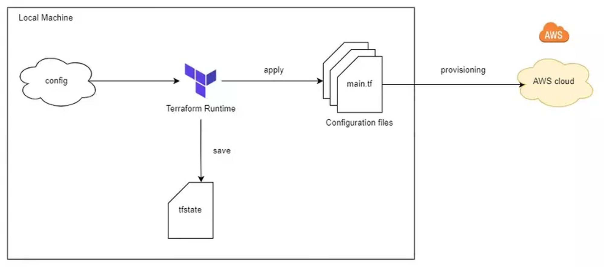
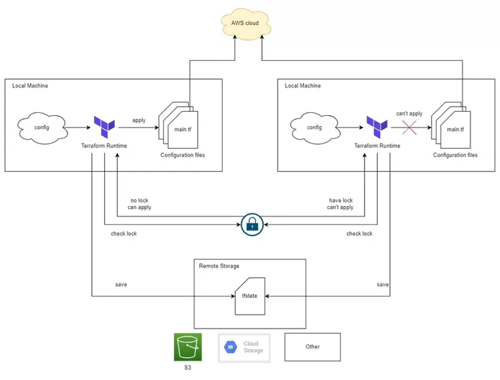
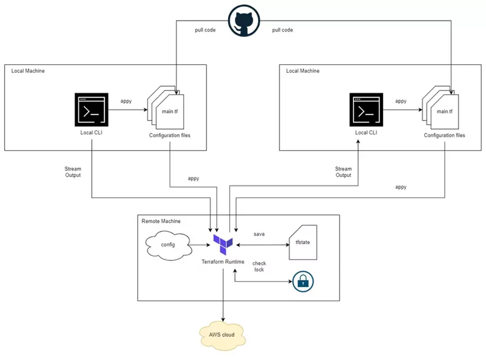
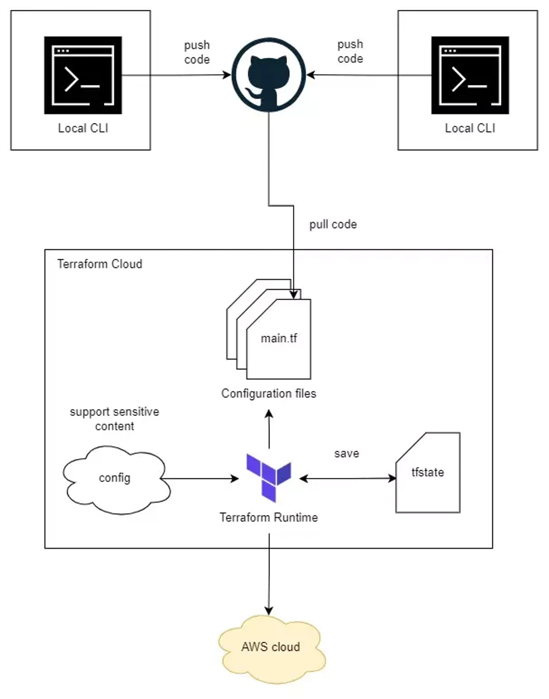

# Terraform backend
- determine where the state file is saved and how tf plan and apply run
- types:
    - local backend
    - standard backend
    - remote backend (enhanced backend)

## Local backend
- Terraform runtime in local
- State file in local


## Standard backend
- Terraform runtime in local
- State file in remote storage (S3 ...)
- Feature: Lock remote state
- Still need to store AWS secret in local -> not secure
- Config
```
terraform {
  backend "s3" {
    bucket         = "state-bucket"
    key            = "team/rocket"
    region         = "us-west-2"
    encrypt        = true
    role_arn       = "arn:aws:iam::<ACCOUNT_ID>:role/state-bucket-assume-role"
    dynamodb_table = "state-assume-lock"
  }
  required_version = ">= 0.15"
  required_providers {
    null = {
      source  = "hashicorp/null"
      version = "~> 3.0"
    }
  }
}
```


## Remote backend
- Run in remote server
- Terraform cli in local only stream the result to our local machine
- Config
```
terraform {
  backend "remote" {
    hostname = "app.terraform.io"
    organization = "hpi"

    workspaces {
      name = "pro"
    }
  }
}
```




# Terraform Cloud
- A platform of Hahshicorp



