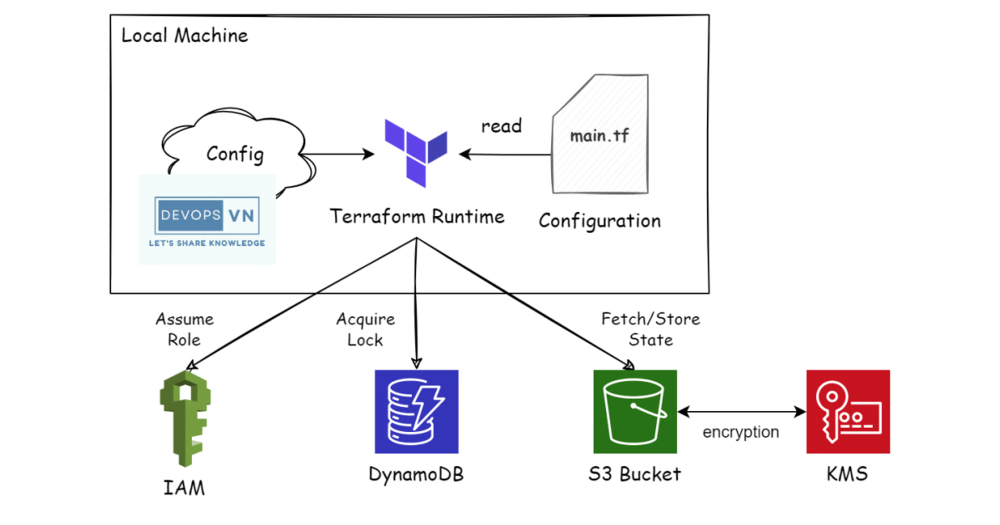
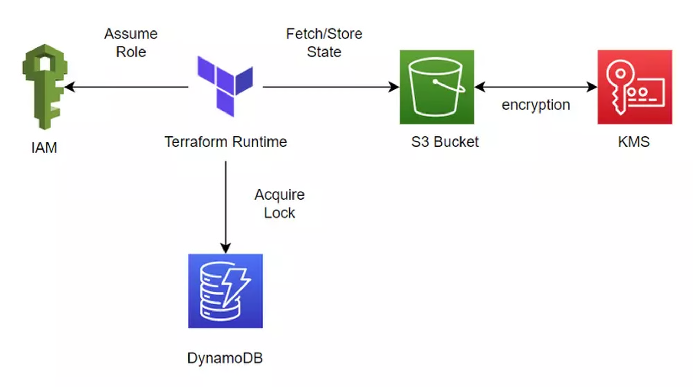
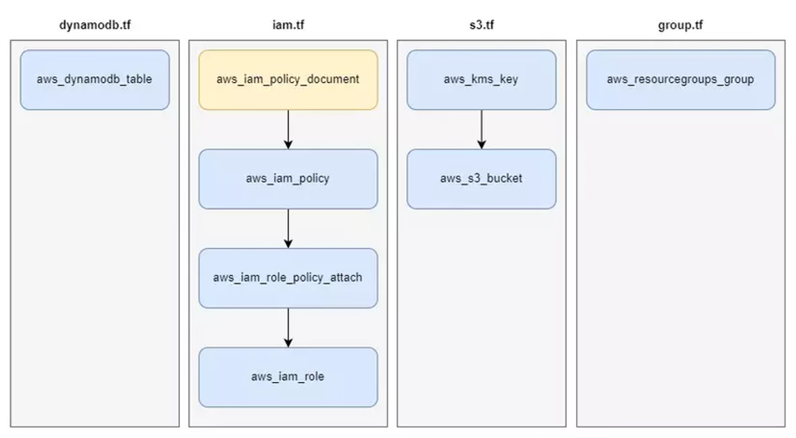

# Practice with standard backend 



- IAM is used for Terraform to Assume Role, to write DynamoDB and read/write state to S3
- Dynamodb was used for writing Lock Key of a Terraform process
- S3 is used for State storing
- KMS is used for data encryption in S3



- verions.tf - specify provider version
- variables.tf - declare variables
- main.tf - add provider aws with region
- dynamodb.tf - add dynamodb for terraform locking
    - Field LockId - type String
- iam.tf
- s3.tf


## Run terraform
```
terraform plan
terraform apply -auto-approve
```

## Check result
```sh
aws resource-groups list-groups
aws resource-groups get-group --group-name project-1-resource-group
aws s3api list-buckets
aws kms list-keys
aws s3api get-bucket-encryption --bucket project-1-terrarform-bucket-1
aws dynamodb list-tables
```
